# Table of contents

- [Overview](#Overview)
  - [Used technologies and libraries](#Used-technologies-and-libraries)
- [Getting started](#getting-started)
- [App functionalities](#app-functionalities)
    - [Managing a document life cycle](#managing-a-document-life-cycle)
        + [Creating](#creating)
        + [Editing and previewing](#editing-and-previewing)
        + [Saving and downloading](#saving-and-downloading)
        + [Renaming](#renaming)
        + [Deleting](#deleting)
    - [Customizing application layout and theme](#customizing-application-layout-and-theme)
        + [Selecting view mode](#selecting-view-mode)
        + [Adjusting section size](#adjusting-section-size)
        + [Switching between color themes](#switching-between-color-themes)
- [Troubleshooting](#troubleshooting)

## Overview

Markdown Editor is an in-browser CRUD application that enables you to create, edit and delete markdown documents and see their live preview. You can also download saved files and edit them locally in your preferred IDE.

### Used technologies and libraries

- Tailwind CSS
- TypeScript
- React.js
- Redux Toolkit
- Firestore Database
- **Other:** [react-markdown](https://github.com/remarkjs/react-markdown), [nanoid](https://www.npmjs.com/package/nanoid), [React Toastify](https://www.npmjs.com/package/react-toastify), [Streamline Icons](https://home.streamlinehq.com/)

## Getting started

You will see either an intial or the last opened document based on what information is stored in your browser and Firestore database.

Click on the **bars icon** to open a navigation side panel.

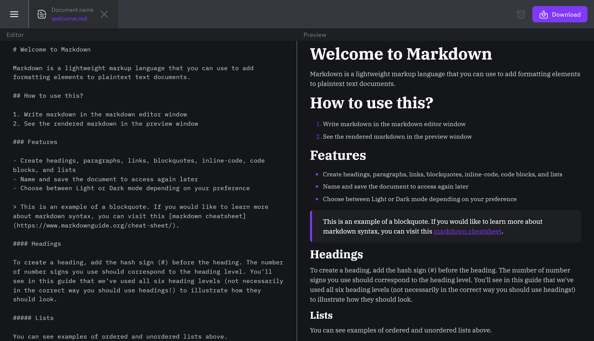

## App functionalities

### Managing a document life cycle

#### Creating

You can create new documents that will be stored in the database.

Document name has to be unique and it must consist of only letters and number - special characters are not allowed.

Maximum title length is 15 characters.

1. Click on the **Create a document** button.

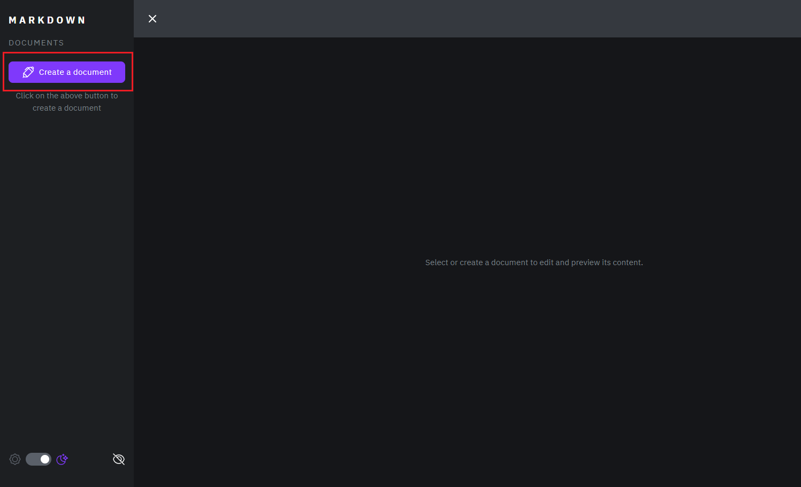

2. Type in the document name and click **Confirm**.

#### Editing and previewing

You can modify the document content by using markdown in the **Editor** section and see live changes in the **Preview** section.

#### Saving and downloading

You can save implemented changes by clicking on the **Save Changes** button.

**Note:** if you switch to a different document without saving, you will lose all of the changes.

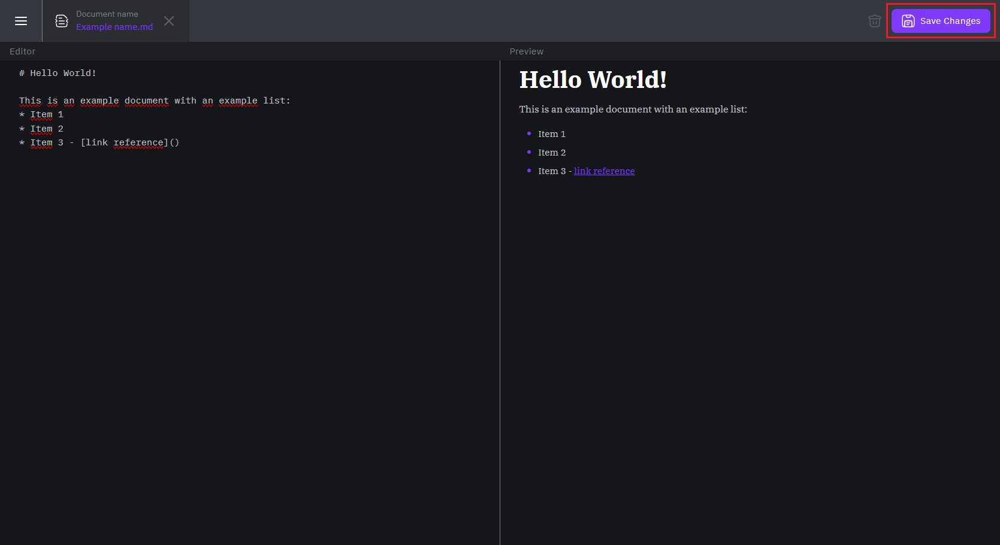

You can download a saved document by clicking on the **Download** button.

The document will be saved on your computer as a `.md` file and you can edit it in a preferred editor.

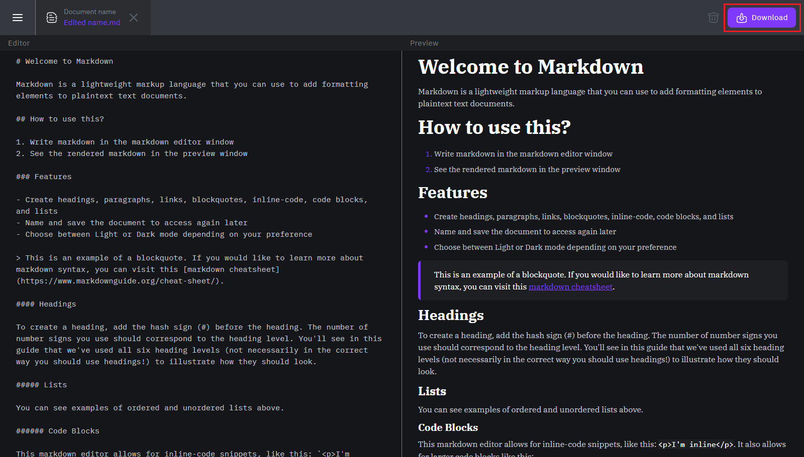

#### Renaming

You can rename a document on displays larger than 992px.

1. Double click on the document name in the navigation bar.

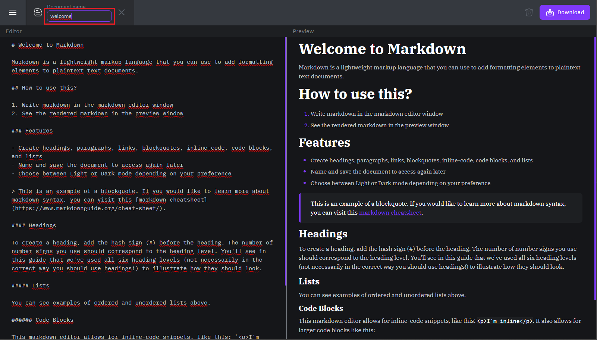

2. Type in the new name and press enter or click away to confirm.

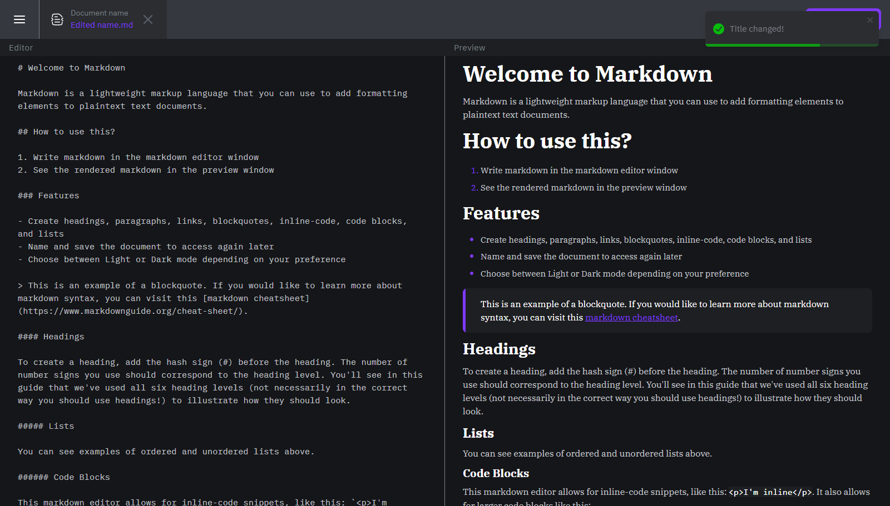

#### Deleting

You can delete all created documents; however, this action is irreversible.

1. Click on the **bin icon**.

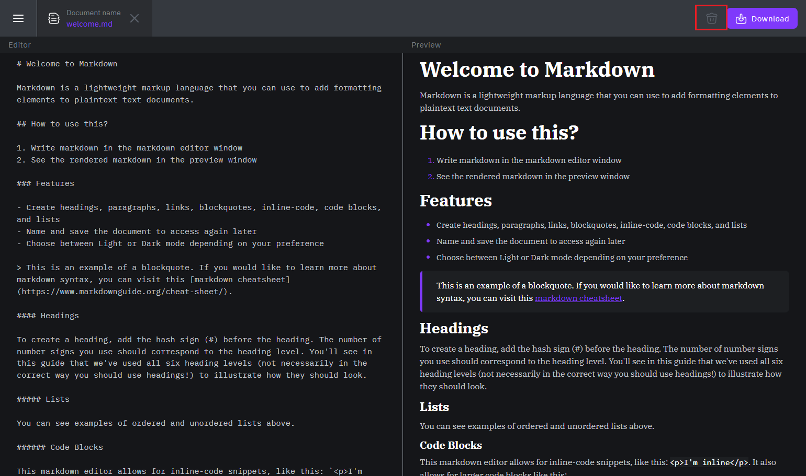

2. Confirm the action.

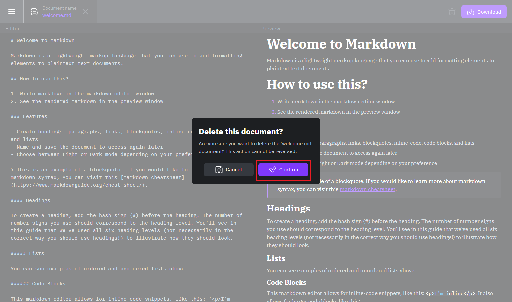

### Customizing application layout and theme

#### Selecting view mode

You can choose from 2 view modes on mobile devices (**Editor** and **Preview**) and 3 (**Editor**, **Preview** and **Comparison**) on displays larger than 768px.

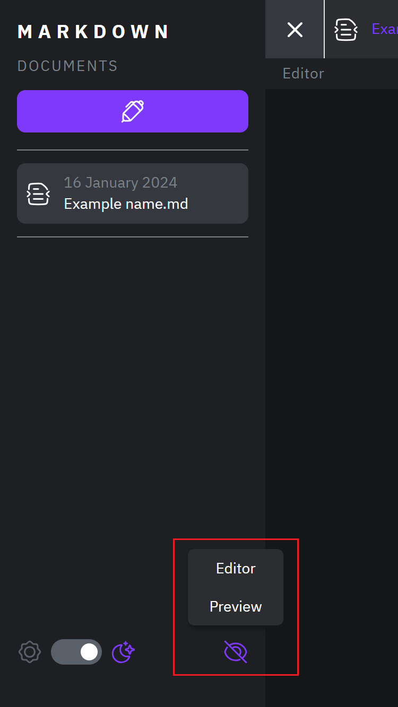

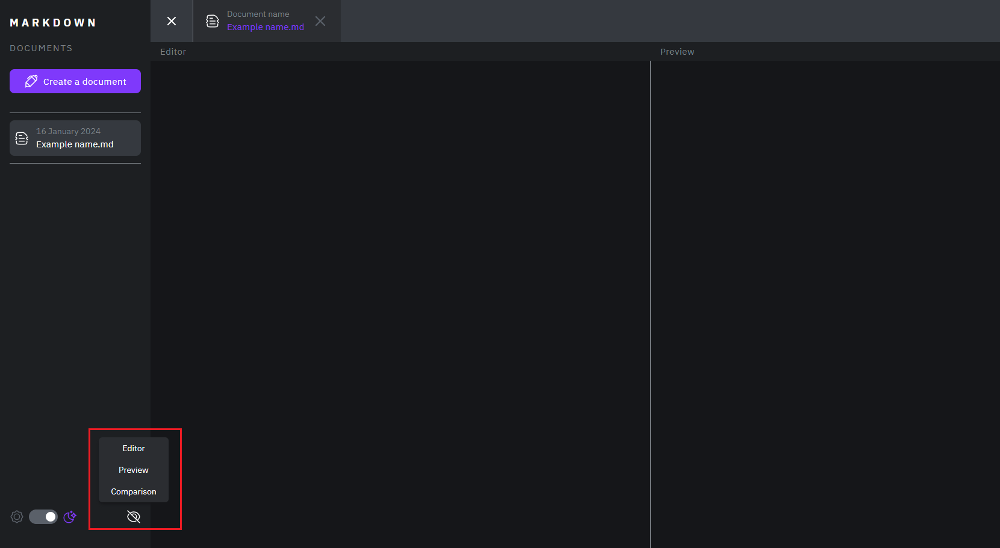

#### Adjusting section size

You can hover over the section divider while in the **Comparison** view mode to enable a resizable handle. Hold it and drag it horizontally to adjust the section size.

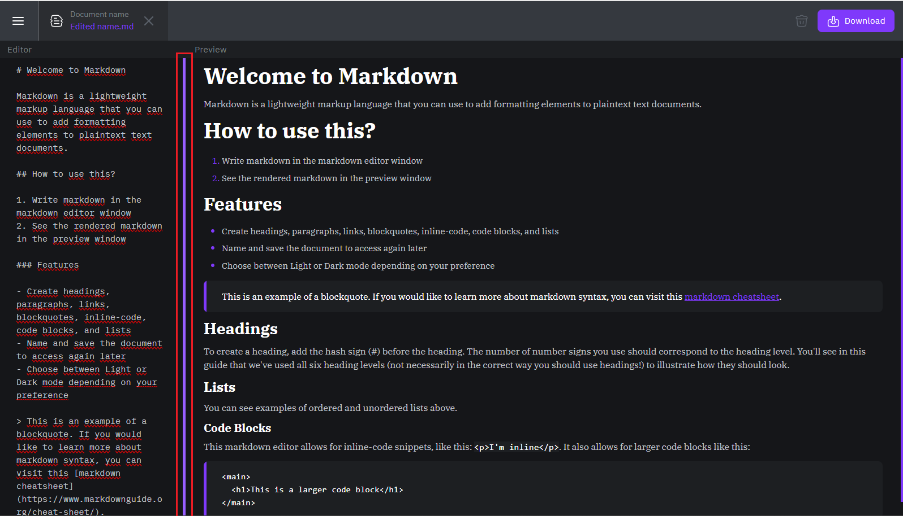

#### Switching between color themes

You can switch between light and dark theme by clicling on the toggler in the aside panel.

**Note:** initial theme is set based on the browser preferences.

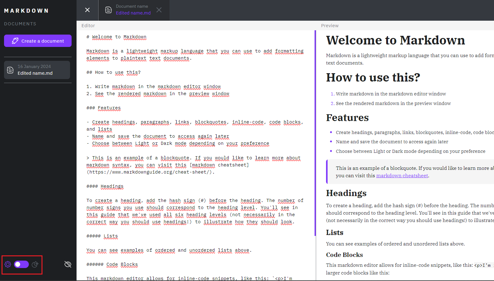

## Troubleshooting

Markdown Editor uses local storage to save user data and connect to the database.

You can clear the local storage or open the application in an icognitio window if you encounter issues that are not related to your internet connection.
